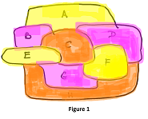
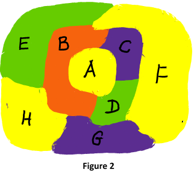
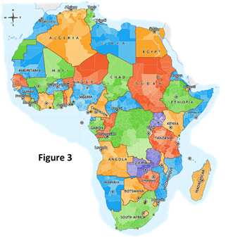

# Problem Statement – The 4-Colour Theorem
**Background**

In mathematics, the four color theorem, or the four color map theorem, states that, given any separation of a plane into contiguous regions, producing a figure called a map, no more than four colors are required to color the regions of the map so that no two adjacent regions have the same color. Adjacent means that two regions share a common boundary curve segment, not merely a corner where three or more regions meet.

Consider the map in Figure 1. Because of the topography of the regions and how they are sharing boundaries, not even 4 colours are required in this case. The map has been coloured using just 3 colours – Orange, Yellow, and Pink. Yet, as per the rules of map colouring, no two adjacent regions have the same colour.

One way of analysing such a map is to list down each region along with its neighbouring regions. So, for the map in Figure 1 we can list the following:

    A -> B, C, D (A has B, C, and D as neighbours)
    B -> A, C, E
    C -> A, B, D
    D -> A, C, F, H
    E -> B, C, G, H
    F -> C, D, G, H
    G -> C, E, F, H
    H -> D, E, F, G

If we were to convert the above into the colours used for each region, then:

(A -> B, C, D) will become (Yellow -> Pink, Orange, Pink). So, it’s clear that none of A’s neighbours have been allotted the same colour as A – which conforms to the map colouring rules. You can validate the map by checking all the other cases too.

Now consider the map in Figure 2. This map requires all the 4 colours in order to colour it as per the map colouring rules. Why does it require all four colours, whereas the earlier map which seemed to be equally complex did not require 4 colours ? If you look closely, you will find that there are 4 regions in the central part of the map that are all adjacent to each other. So, none of them can be of the same colour, and therefore all 4 colours must be used. However, there does not seem to be any requirement for a 5th colour. Notice that region A, which has been coloured Yellow, has been totally surrounded by B, C, and D. And therefore, the yellow colour can now be used again to colour the outer regions.

The analysis of the map in Figure 2, yields the following data:

    A -> B, C, D
    B -> A, C, D, E, F, G, H 	(Every single region)
    C -> A, B, D, F
    D -> A, B, C, F, G
    E -> B, F, H
    F -> B, C, D, E, G
    G -> B, D, F, H
    H -> B, E, G

Figure 3 shows a real-life map of Africa that has been coloured using 4 colours. To make it more interesting they have used shades of the same colour within a region to indicate additional information

The 4-colour theorem is unique in the world of mathematics because in 1976, it was the first theorem that was proven using computers. You may want to read more about the 4-colour theorem here: 

 https://en.wikipedia.org/wiki/Four_color_theorem

 **Challenge – Part 1**

**Task 1** 

The first task in this challenge involves design. You need to construct a model of a planar map that makes it easy to enter details of a map into a Java program for further analysis.

**Task 2**

Now write a Java program that interactively asks the user for the number of regions in the map. Then for each region in the map, it asks for the number of neighbours. Finally, it asks for the names of each of the neighbouring regions. Store this data as per the modelling you have done in Task 1.

**Task 3**

Once, the map data entry is complete, your program should list out the details of the map as shown earlier in this document. For example, in the case of the map in Figure 2, the details can be shown as:

There are 8 regions in the map. They are named A, B, C, D, E, F, G, and H
The neighbouring regions for each region are as follows:

    A -> B, C, D
    B -> A, C, D, E, F, G, H
    C -> A, B, D, F
    D -> A, B, C, F, G
    E -> B, F, H
    F -> B, C, D, E, G
    G -> B, D, F, H
    H -> B, E, G

Make appropriate assumptions where necessary in order to tackle this challenge.

**Challenge – Part 2**

**Task 4**

Now that you have the map data readily available in your program, you need to write a method that can be used to colour the map in accordance with the rules of map colouring. Hopefully, the modelling that you have done can handle the assignment of a colour for each of the regions. If not, you will need to enhance the design as required. Your method should use the minimum number of colours required.

For the limited scope of this challenge, assume that the only 5 colours allowed are:  “Red”, “Blue”, “Green”, “Yellow”, and “Black” in this sequence. So, for example, if a map requires only 3 colours, then only “Red”, “Blue”, and “Green” should be used to colour all the regions.

Your method should return an int value indicating the number of colours used. 

***Hint: This method requires a recursive strategy.***

Task 5 - Once, the map has been coloured, display the map details with the colours assigned. For example:

    A (Yellow) -> B (Red), C (Blue), D (Green)
    B (Red)    -> A (Yellow), C (Blue), D (Green), E (Green), F (Yellow), G (Blue), H (Yellow)
    C (Blue)   -> A (Yellow), B (Red), D (Green), F (Yellow)
    … etc.

Through your program you should be able to show that no matter what kind of a planar map the user enters, no more than 4 colours are required to colour the map, and the “Black” colour is never used.

